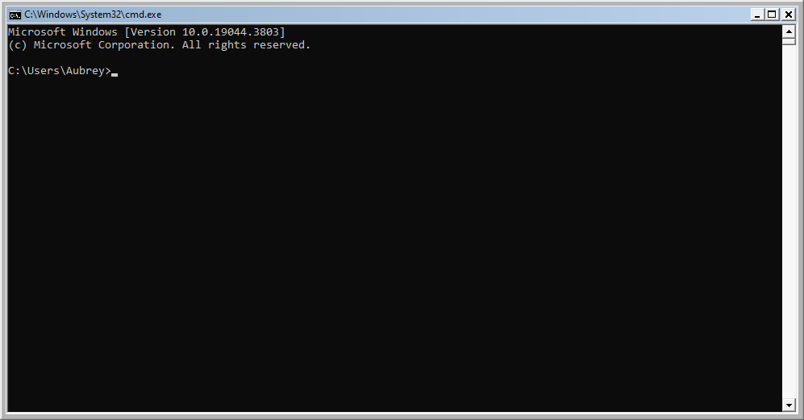

# ConhostEX
This is a modified version of the OpenConsole project from the Windows Terminal
to allow client-edge style on Conhost V2, and classic frames.

# How to Install
1. Download conhost.exe from the latest release
2. Take ownership of and rename conhost.exe in System32
3. Put the downloaded conhost.exe in its place

# How to Use
By default, only the client-edge style will be enabled. To enable the classic
frames, open the Registry Editor, create `HKEY_CURRENT_USER\Console\ClassicTheme`
as a DWORD, and set it to 1.

# How to Build
[Prerequisites](https://github.com/microsoft/terminal?tab=readme-ov-file#prerequisites)

1. Clone the repository with `git clone https://github.com/aubymori/ConhostEX`
2. `cd ConhostEX`, and run `git submodule update --init --recursive`
3. Open the OpenConsole.sln solution in Visual Studio 2022
4. Make sure your build configuration is how you want it (most likely Release x64)
5. Right click the "Conhost" group, and click build
